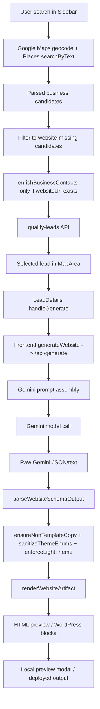

<!-- @format -->

# Full Website Generation Audit

## Scope

This audit traces the full website generation pipeline from lead discovery through Gemini generation, parsing, normalization, rendering, and final preview output.

The main question is why generated sites can feel generic, repetitive, sparse, or placeholder-like even when the generation system is supposed to be category-aware and premium.

## Executive Summary

The pipeline is not failing in just one place. The current behavior comes from a combination of:

1. Lead enrichment that mostly does not enrich no-website candidates.
2. Gemini prompts that do not receive the search/map/review context from discovery.
3. A parser that merges raw Gemini JSON but does not canonicalize malformed section shapes.
4. Renderer logic that still imposes a fixed section order and only renders a narrow set of section structures.
5. Multiple fallback paths that can silently replace rich Gemini output with sparse template content.

The strongest root causes are:

- The generation prompt does not include grounded search/map/review data, only basic business fields and image URLs.
- The lead enrichment step skips businesses without a website, which means the candidates that need images the most often do not get them.
- `parseWebsiteSchemaOutput()` does not transform section shapes like `kind` -> `type` or nested `content` into the renderer's expected fields.
- `renderPageBody()` ignores schema ordering and always renders the same hero/features/gallery/testimonials/cta/faq/contact sequence.
- The frontend fallback in [src/lib/gemini.ts](src/lib/gemini.ts#L27) still produces small, placeholder-like sites if the backend fails.

## End-to-End Data Flow



## Pipeline Trace

### 1. User search and lead discovery

The search entry point is [src/components/Sidebar.tsx](src/components/Sidebar.tsx#L114). It does the following:

- Geocodes the city with the Google geocoding library.
- Runs `Place.searchByText()` with a `textQuery` like `dry cleaner in San Francisco`.
- Pulls Places fields: `id`, `displayName`, `location`, `formattedAddress`, `rating`, `userRatingCount`, `websiteURI`, `nationalPhoneNumber`, `photos`, `businessStatus`.
- Maps those results into `Business` objects.
- Filters to website-missing candidates.
- Calls `enrichBusinessContacts()` and then `qualifyLeads()`.

Relevant code:

- [src/components/Sidebar.tsx](src/components/Sidebar.tsx#L35)
- [src/components/Sidebar.tsx](src/components/Sidebar.tsx#L73)
- [src/components/Sidebar.tsx](src/components/Sidebar.tsx#L114)
- [src/components/Sidebar.tsx](src/components/Sidebar.tsx#L188)
- [src/components/Sidebar.tsx](src/components/Sidebar.tsx#L189)

### 2. Lead enrichment

The enrichment helper is [src/components/Sidebar.tsx](src/components/Sidebar.tsx#L35). It fetches [server.ts](server.ts#L1955) `/api/enrich-business` only when a business already has a `websiteUri`.

That is a major problem:

- Website-missing leads are the exact leads this app is trying to find.
- Those leads are the ones most likely to need image suggestions and contact extraction.
- But the enrichment function returns early when `websiteUri` is missing.

This means the businesses that make it through the search filter are usually not enriched at all.

### 3. Lead qualification

The qualification helper is [server.ts](server.ts#L380) and the route is [server.ts](server.ts#L2005).

It uses Gemini with live tools:

- `googleMaps`
- `googleSearch`
- optional `retrievalConfig.latLng` when a location is present

It returns only businesses where:

- `hasWebsite === false`
- and there is either an email or phone number

This is a strong filter, so the pipeline intentionally discards candidates without contact details.

### 4. Lead selection and generation trigger

The selected business is passed into [src/components/LeadDetails.tsx](src/components/LeadDetails.tsx#L82). That component:

- Calls `generateWebsite(business)`
- Renders the returned schema into HTML with [src/lib/website-renderer.ts](src/lib/website-renderer.ts#L1286)
- Converts the schema into WordPress blocks with [src/lib/wordpress.ts](src/lib/wordpress.ts)
- Provisions WordPress after generation

Relevant code:

- [src/components/LeadDetails.tsx](src/components/LeadDetails.tsx#L82)
- [src/components/LeadDetails.tsx](src/components/LeadDetails.tsx#L84)
- [src/components/LeadDetails.tsx](src/components/LeadDetails.tsx#L90)
- [src/components/LeadDetails.tsx](src/components/LeadDetails.tsx#L144)

### 5. Frontend wrapper

The frontend wrapper in [src/lib/gemini.ts](src/lib/gemini.ts#L1) sends the business payload to `/api/generate`.

If the backend fails, the frontend silently falls back to a conservative dry-run schema:

- [src/lib/gemini.ts](src/lib/gemini.ts#L27)

That fallback is still a sparse placeholder-style site, especially for categories other than the ones specifically handled.

### 6. Backend generation route

The main generation route is [server.ts](server.ts#L1644).

It does this:

- Checks `WEBSITE_GENERATION_MODE`.
- If `template`, returns the fallback schema immediately.
- If `genai` is missing, returns the fallback schema.
- Builds a long prompt.
- Tries `gemini-3.1-pro-preview`, then `gemini-2.5-flash`.
- Parses the response.
- Returns `ensureNonTemplateCopy(parsedSchema, business)`.
- On any error, returns `createFallbackWebsiteSchema(req.body)`.

Relevant code:

- [server.ts](server.ts#L1637)
- [server.ts](server.ts#L1666)
- [server.ts](server.ts#L1782)
- [server.ts](server.ts#L1826)
- [server.ts](server.ts#L1837)

### 7. Parsing and normalization

The parser is [server.ts](server.ts#L453). It:

- Extracts a JSON object from raw text.
- Parses it.
- Merges it with fallback schema defaults.
- Uses `root.sections` if present, otherwise falls back to `fallback.sections`.
- Sanitizes theme enums.
- Forces light colors with `enforceLightTheme()`.

It does not:

- Canonicalize `kind` to `type`
- Canonicalize nested `content.headline` / `content.title` to top-level renderer fields
- Repair section objects that are close to valid but not exactly valid
- Validate whether section items are structurally useful for the renderer

Relevant code:

- [server.ts](server.ts#L453)
- [server.ts](server.ts#L478)
- [server.ts](server.ts#L514)
- [server.ts](server.ts#L663)
- [server.ts](server.ts#L718)

### 8. Renderer input and HTML generation

The final schema is passed to [src/lib/website-renderer.ts](src/lib/website-renderer.ts#L1286).

Important behavior:

- `renderWebsiteArtifact()` normalizes the theme and brand.
- `renderPageBody()` does not respect original schema ordering.
- `renderPageBody()` always constructs sections in the same fixed order:
  hero -> features -> gallery -> testimonials -> cta -> faq -> contact.

That fixed ordering is a major template-like behavior.

Relevant code:

- [src/lib/website-renderer.ts](src/lib/website-renderer.ts#L488)
- [src/lib/website-renderer.ts](src/lib/website-renderer.ts#L509)
- [src/lib/website-renderer.ts](src/lib/website-renderer.ts#L1260)

## Exact Prompts

### Lead qualification prompt

Source: [server.ts](server.ts#L380)

```text
You are qualifying a local business lead using live grounded data.

Business:
- Name: ${business.name}
- Category: ${business.category || "Unknown"}
- Address: ${business.address || "Unknown"}
- City/Area: ${city || "Unknown"}
- Existing website from app: ${business.websiteUri || "None found"}
- Existing phone from app: ${business.phoneNumber || "Unknown"}

Task:
1. Determine whether this business appears to have an official website right now.
2. Find the best public contact email for the business, if one exists.
3. Find the best public phone number for the business, if one exists.

Rules:
- Use grounded live sources only.
- If an official business website exists, set hasWebsite to true.
- Only return an email if it is a business contact email that is publicly available.
- Do not guess.
- Prefer high confidence only; otherwise leave fields blank.

Return only valid JSON in this exact shape:
{
  "hasWebsite": true,
  "websiteUri": "https://example.com",
  "email": "info@example.com",
  "phoneNumber": "(555) 555-5555",
  "confidence": "high",
  "notes": "short explanation"
}
```

This prompt is only for lead qualification. It is not the website-generation prompt.

### Website generation prompt

Source: [server.ts](server.ts#L1666)

The full prompt is long and category-driven. It explicitly requires:

- light theme only
- premium spacing and composition
- category distinction
- 7-9 sections
- strong hero, features, gallery, testimonials, faq, cta, contact
- no markdown output
- JSON only
- use of `${creativeSeed}`
- use of business context and reference images

The closing instruction is at [server.ts](server.ts#L1769).

Key facts about this prompt:

- It does not include reviews, map grounding, search summaries, or qualification notes.
- It only includes business basics and image URLs.
- It asks Gemini for JSON that matches `WebsiteSchema`, but the schema shape in practice varies.

## Fallback Matrix

### Server-side fallback

Fallback schema is injected in these places:

- If `WEBSITE_GENERATION_MODE === "template"` -> [server.ts](server.ts#L1647)
- If `genai` is missing -> [server.ts](server.ts#L1654)
- If `parseWebsiteSchemaOutput()` returns null -> [server.ts](server.ts#L1831)
- If the whole route throws -> [server.ts](server.ts#L1837)

There is also an internal fallback merge inside the parser:

- [server.ts](server.ts#L478)

### Frontend fallback

Frontend fallback is in [src/lib/gemini.ts](src/lib/gemini.ts#L27).

If the backend request fails, the frontend returns a conservative dry-run schema with:

- a small theme object
- only hero, features, gallery, and contact sections
- placeholder copy

This is one of the strongest reasons the app can feel like a mockup instead of a full production site.

### Fallback summary

Fallback is not rare by design. It is reachable on:

- missing API key
- template mode
- parse failures
- network failures
- any exception in `/api/generate`

## Grounding and Enrichment Analysis

### What grounding actually does today

Grounding is used in two places:

1. Lead qualification in [server.ts](server.ts#L380) with Google Maps and Google Search tools.
2. Lead discovery in [src/components/Sidebar.tsx](src/components/Sidebar.tsx#L114) through the Google Maps Places JS library.

### What grounding does not do

The generation prompt does not receive:

- review snippets
- map summaries
- qualification notes
- search results text
- neighborhood context
- ranking evidence

So although the app does grounded search and qualification, that data is not passed into the site-generation prompt.

### Why galleries stay empty or weak

The enrichment helper is gated on `websiteUri`:

- [src/components/Sidebar.tsx](src/components/Sidebar.tsx#L35)

But the search flow deliberately prefers no-website leads:

- [src/components/Sidebar.tsx](src/components/Sidebar.tsx#L173)

That means the candidates most likely to be generated often do not get image suggestions or extracted contact enrichment.

This is a major reason gallery sections can be empty or underpopulated.

## Renderer Analysis

### Current renderer behavior

The renderer is visually strong, but structurally rigid.

It now does use schema-driven voice for section headings after the recent fix, but the following issues remain:

- `renderPageBody()` ignores the original schema order.
- It always renders a fixed sequence.
- It only renders one section of each type.
- It depends on valid section `type` values.
- It does not canonicalize malformed sections.

### Why sections can render empty

If Gemini returns sections with shapes like:

- `kind` instead of `type`
- nested `content` instead of top-level `headline`, `items`, etc.

then the renderer may ignore them or render only partial output.

This was visible in the live comparison: one cafe raw output used `kind` fields, and the raw render only surfaced the contact section.

### Why the output feels template-like

Even with good content, the renderer still forces:

- same section order
- same semantic layout per section type
- fixed contact section at the end

So category variety can be lost after schema generation.

## Live Generation Evidence

I ran real generation tests for three categories using the live server and direct Gemini calls.

### Dry cleaner

- Model used: `gemini-3.1-pro-preview`
- Raw Gemini output: valid JSON with rich category-specific content
- Final `/api/generate` output: valid schema with dry-cleaner-specific sections
- Rendered output: premium local-service content, not blank

Observed section headings from final render:

- Complete wardrobe management
- Precision at every step
- Trusted by San Francisco professionals
- Ready To Elevate Your Brand?
- Frequently asked questions
- Let's Build Your Next Version

### Salon

- Model used: `gemini-3.1-pro-preview`
- Raw Gemini output: valid JSON with rich salon content
- Final `/api/generate` output: valid schema with a different ordering and salon-specific copy
- Rendered output: strong category-specific result

Observed section headings from final render:

- Bespoke Studio Offerings
- A Space Designed for Rest
- Client Reflections
- Schedule Your Appointment
- Studio Policies & Preparation
- Book Pearl Studio Salon

### Cafe

- Model used: `gemini-3.1-pro-preview`
- Raw Gemini output: schema shape drifted and used `kind` fields instead of `type` in the raw sample
- Raw render from that sample only surfaced the contact heading
- Final `/api/generate` output: valid normalized schema with a complete cafe site
- Rendered output: correct category-specific headings

Observed section headings from final render:

- Our Approach to Craft
- A Space to Breathe
- Words from Our Guests
- Reserve Your Table
- Common Inquiries
- Visit Juniper Coffee House

### What the comparison proves

Gemini itself can produce rich, category-specific sites.
The degradation happens when:

- the output shape changes
- parsing does not canonicalize it
- fallback paths or renderer assumptions kick in

## Root Cause Analysis

### Root cause 1: Generation does not receive grounded context

The prompt only includes business basics and reference images.
It does not include review data, map summaries, search evidence, or qualification notes.

Impact:

- weak grounding
- generic language
- gallery starvation
- less believable business-specific content

### Root cause 2: Enrichment is skipped for no-website leads

The enrichment helper in [src/components/Sidebar.tsx](src/components/Sidebar.tsx#L35) returns early when `websiteUri` is missing.
But the search pipeline preferentially selects businesses without a website.

Impact:

- imageSuggestions often stay empty
- gallery sections end up sparse
- preview feels underfilled

### Root cause 3: Parser does not canonicalize model drift

[server.ts](server.ts#L453) merges JSON and theme defaults, but it does not repair malformed section shapes.
It does not map `kind` -> `type`, or nested `content` into renderer-compatible fields.

Impact:

- sections can disappear
- renderer can skip malformed sections
- partially rendered sites look template-like

### Root cause 4: Renderer ignores schema ordering

[src/lib/website-renderer.ts](src/lib/website-renderer.ts#L509) always renders hero, features, gallery, testimonials, cta, faq, contact in that order.
The category-aware section sequence coming from Gemini is not preserved.

Impact:

- repeated composition
- same rhythm across categories
- less premium and less distinct

### Root cause 5: Fallbacks are still placeholder-heavy

The server fallback schema and the frontend dry-run schema are both smaller and more generic than the ideal output.
The frontend fallback in [src/lib/gemini.ts](src/lib/gemini.ts#L27) is especially sparse.

Impact:

- any transient generation failure can produce a prototype-like site
- fallback can mask upstream errors
- users may think Gemini is bad when fallback is actually being used

### Root cause 6: Preview and production paths were not always using the freshest render path

The local preview work fixed the immediate browser behavior, but the underlying pipeline still depends on the same schema and renderer constraints.
This means a site can look correct in one path and generic in another if cached content or older renders are used.

## What Is Not the Main Problem

### Gemini is not the primary failure mode

The direct raw samples show Gemini can generate good category-specific content.
That means the model is capable.
The main failures are downstream:

- prompt context
- schema shape consistency
- parser repair
- renderer ordering and assumptions
- fallback safety nets

## Recommendations

### Highest priority

1. Add grounding data to the generation prompt.
   - Pass in reviews, map context, business name, category, photos, contact summary, and qualification notes.
   - Do not send only the bare business object.

2. Canonicalize Gemini output before rendering.
   - Normalize `kind` -> `type`.
   - Normalize nested `content` fields into top-level renderer fields.
   - Repair section objects that are close to valid but not exact.

3. Make the renderer respect schema order.
   - Render sections in the order Gemini produced.
   - Only use the fixed order as a fallback.

4. Stop skipping enrichment for the leads that need it most.
   - Enrich no-website candidates using search or external signals, not only existing website URLs.

### Medium priority

5. Reduce silent fallback behavior.
   - Log whenever the frontend fallback is used.
   - Log parse failures with raw snippets.
   - Surface fallback usage in the UI.

6. Expand fallback schemas so they look production-ready if they must exist.
   - More sections
   - More real copy
   - Stronger category-specific data
   - Better image placeholders

### Lower priority

7. Add schema diagnostics to the UI.
   - Show raw Gemini shape vs final schema shape.
   - Show when a render is using fallback.

8. Add automated tests for malformed Gemini shapes.
   - `kind` vs `type`
   - `content` vs top-level fields
   - empty gallery/testimonial arrays
   - fallback injection paths

## Evidence Files

- Raw vs final comparison data: [tmp-audit-results.json](tmp-audit-results.json)
- Generator prompt source: [server.ts](server.ts#L1666)
- Parser source: [server.ts](server.ts#L453)
- Fallback injection points: [server.ts](server.ts#L1647)
- Frontend dry-run fallback: [src/lib/gemini.ts](src/lib/gemini.ts#L27)
- Renderer order and section output: [src/lib/website-renderer.ts](src/lib/website-renderer.ts#L488)
- Lead discovery and enrichment: [src/components/Sidebar.tsx](src/components/Sidebar.tsx#L35)
- Generation trigger: [src/components/LeadDetails.tsx](src/components/LeadDetails.tsx#L82)

## Bottom Line

The generated sites are not just failing because Gemini is weak.
They feel template-like because the pipeline is dropping context, tolerating malformed JSON, falling back too easily, and rendering sections in a fixed template order.

The most important fix is to make the data flow canonical and grounded before the renderer sees it.
